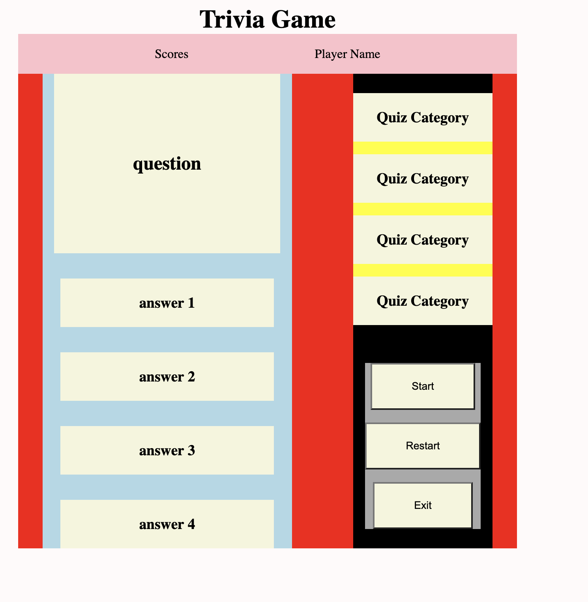

A README.md file that includes the following sections:

(An embedded screenshot of the app)

(List of the Technologies used)
HTML
css
javascript

 ** Installation instructions **
click on enter to enter the game.
click on start button on the bottom right to start the game.
for restarting the game use restart button on the bottom right.
you can exit by clicking on exit button

 (Your User stories – who are your users, what do they want and why?)
#user can choose between four different categories.
#user can get points when they click on the right answer.
#user can start or restart or exit the game.

 Your Wireframes – sketches of major views / interfaces in your application
Asset/img/IMAGE 2022-09-07 07:14:00.jpg

 (Descriptions of any Unsolved problems or major hurdles you had to overcome)
#question randomizer produce repetitive questions.
#size of text change unevenly.
#name of the player doesn's save on the any server